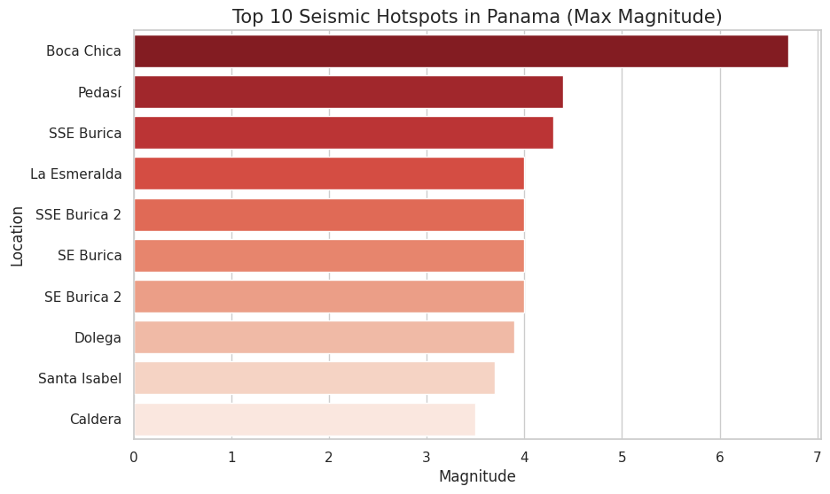
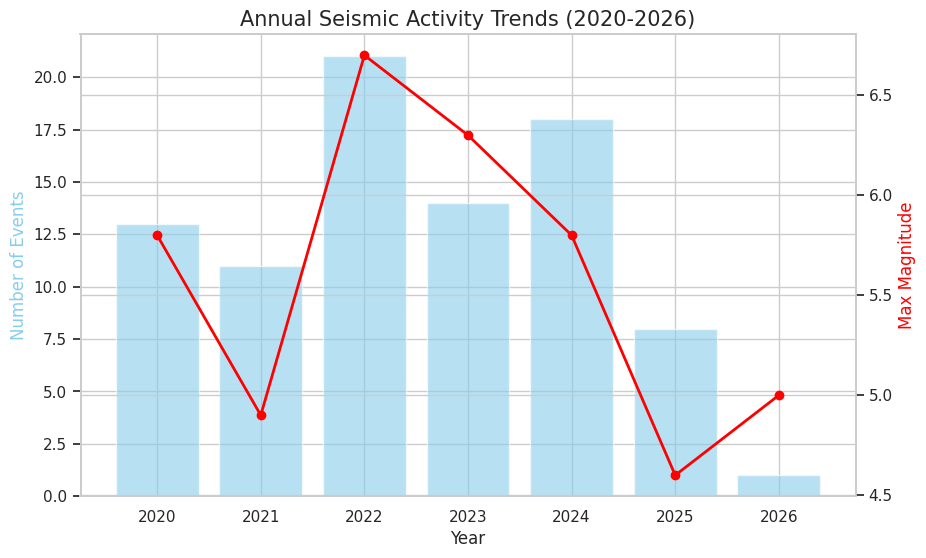

# Panama Seismic Risk Analysis (2020-2026)
### *Data Engineering & SQL Analytics Project for Government Risk Management*

## 1. Project Overview
This project analyzes seismic activity in Panama to provide data-driven insights for the Ministry of Finance and Infrastructure. By processing raw USGS data, the study identifies high-risk hotspots and vulnerability patterns to justify emergency fund allocations and infrastructure reinforcements.

## 2. Tech Stack
* **Data Source:** United States Geological Survey (USGS) API.
* **Data Cleaning:** Excel.
* **Storage & Analysis:** Google BigQuery (SQL).
* **Visualization:** Google Looker Studio.

## 3. Key SQL Analysis & Insights

### A. High-Risk Infrastructure Hotspots
*Analyzed frequency and peak magnitude by location to identify critical zones.*

```sql
SELECT 
    place, 
    COUNT(*) AS earthquake_count, 
    ROUND(AVG(mag), 2) AS average_magnitude, 
    MAX(mag) AS max_magnitude
FROM `your-project.panama_risk_analysis.seismic_events`
WHERE mag >= 3.0
GROUP BY place
ORDER BY earthquake_count DESC
LIMIT 10;
```
**Strategic Insight:** The analysis identifies Boca Chica as a high-magnitude zone ($6.7 Mag$). Frequent clusters in the Burica region suggest an active fault line that requires permanent seismic monitoring to protect southern coastal communities and maritime infrastructure.

## B. Vulnerability Assessment (Depth Analysis)
*Categorizing events by depth is crucial for engineering; shallow earthquakes release more energy directly into surface structures.*
```sql
SELECT 
    CASE 
        WHEN depth <= 30 THEN 'Shallow (Critical Risk)'
        WHEN depth > 30 AND depth <= 70 THEN 'Intermediate (Moderate Risk)'
        ELSE 'Deep (Low Risk)'
    END AS risk_category,
    COUNT(*) AS total_events,
    ROUND(COUNT(*) * 100.0 / SUM(COUNT(*)) OVER(), 2) AS percentage_of_total
FROM `gee-course-465115.panama_risk_analysis.seismic_events`
GROUP BY risk_category
ORDER BY total_events DESC;
```
**Strategic Insight:** A critical 91.86% of all recorded events are classified as "Shallow." This indicates that nearly all seismic energy in Panama is released close to the surface, posing a direct threat to the Panama Canal locks, bridges, and urban centers.

## C. Annual Trends for Budget Planning
This trend analysis helps the Ministry of Finance justify the National Emergency Fund based on historical activity peaks.
```sql
SELECT 
    EXTRACT(YEAR FROM CAST(time AS TIMESTAMP)) AS event_year, 
    COUNT(*) AS annual_event_count,
    ROUND(MAX(mag), 1) AS peak_magnitude
FROM `gee-course-465115.panama_risk_analysis.seismic_events`
GROUP BY event_year
ORDER BY event_year DESC;
```
**Strategic Insight:** Although event frequency varies, the presence of high-magnitude peaks (such as the 6.7 in 2022) proves that Panama must maintain a permanent emergency reserve. The data confirms that seismic risk is persistent, justifying consistent annual funding for disaster relief.

## 4. Visualizations
## 4. Final Visualizations

### A. Geographical Risk (Hotspots)
This chart identifies the locations with the highest recorded magnitudes. **Boca Chica** stands out as the highest-risk zone.


### B. Structural Vulnerability (Depth Analysis)
Almost all seismic activity is shallow, which directly impacts surface infrastructure and urban safety.


### C. Historical Activity Trends
Correlating the volume of events with peak intensity to justify emergency budget allocations.


## 5. Final Recommendations
**Infrastructure:** Prioritize structural audits for hospitals and bridges in the Chiriqui and Burica regions.

**Policy:** Update the National Building Code to account for the high percentage of shallow-depth seismic risk.

**Fiscal:** Maintain disaster relief budgets aligned with the high-activity baseline established in 2022.

---

## Author
**María Castillo**
